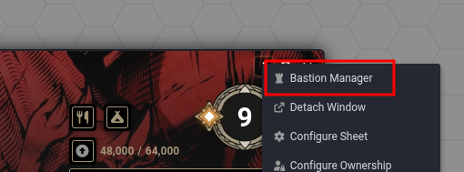
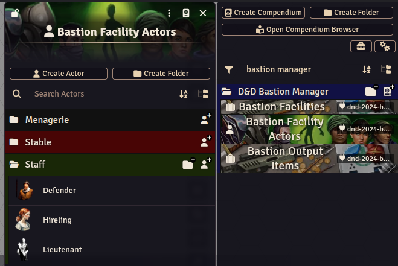

# DnD 2024 Bastion Manager

A FoundryVTT module for managing the Bastion system from the 2024 *Dungeons & Dragons Player's Handbook*. Tracks facilities, orders, hirelings, and bastion turns for one or more characters.

---

## Installation

In Foundry, go to **Add-on Modules → Install Module** and paste the following manifest URL into the field at the bottom:

```
https://raw.githubusercontent.com/Unosami/dnd-2024-bastion-manager/main/module.json
```

**Requirements:** Foundry V14+, dnd5e system v5.0+.

---

## How It Works

### Opening the Bastion Manager

The Bastion Manager window can be opened three ways:

- **From the character sheet** — a "Bastion" button appears in the sheet header for any character who has bastion facilities. Click it to open their manager.
- **From the scene controls** — a bastion icon appears in the left sidebar. Click it to select a character and open their manager.
- **From the Bastion tab** — the character sheet's Bastion tab (Enabled in "Game Settings -> Dungeons & Dragons Fifth Edition -> Configure Bastions -> Enable Bastion Functionality") is augmented with per-facility controls and an "Open Full Manager" button.


If the character sheet is detached into its own browser window (using Foundry V14's native detach feature), the Bastion Manager will also open in a detached window.

### The Manager Window

The manager window shows all of a character's bastion facilities. For each facility you can:

- **Assign an order** for the upcoming bastion turn (Maintain, Craft, Harvest, Recruit, Research, Trade, or Empower).
- **Track facility-specific details** such as craft queues, armory stock, and hireling counts.
- **Build new facilities** using the "Found Bastion" or "Build Facility" buttons.
- **Demolish facilities** 

### Advancing a Bastion Turn

When the GM is ready to resolve a bastion turn, they use the "Advance Bastion Turn" button in the manager or scene controls. This processes all assigned orders and updates facility states. If a bastion has all facilities set to "Maintain" a bastion event roll is also prompted at this stage.

There is also an option that allows you to hook the bastion turn directly to the Dungeons & Dragons 5e calendar. The *Simple Calendar Reborn* module also works with the Bastion Manager and will be prioritized over the native calendar.

### Hirelings and Defenders

Facilities that employ hirelings (such as the Barracks, War Room, and Pub) can create actual Foundry actors in your world when staff are recruited. These actors are drawn from the *Bastion Facility Actors* compendium included with the module. You can customize which actor template is used for each facility type in the module settings under **Configure Hireling Templates**.


### Group Overview

If multiple characters in the party have bastions, the scene control opens a group overview showing all bastions at a glance, with quick access to each character's full manager.

---

## Rules Interpretations

Some bastion rules required interpretation. Here are the decisions made that are not explicitly spelled out in the rules, organized by facility.

**General**

- **Facility Construction.** The Bastion rules specifically describe that the founding of a Bastion at level 5 happens instantly and for free:
      "It's fair to assume that work has been going on behind the scenes of the campaign during a character's early adventuring career, so the Bastion is ready when the character reaches level 5." *DMG 2024 pg.334*
  But that same consideration is not described for special facilities added at higher levels. I added a setting for the DM to choose whether new Special Facilities get built using the rules for building Basic Facilities, or if they are always added instantly and for free. By default, Special Facilities take time to construct and have a gold cost.

**Armory**

- **Partially-stocked armory.** There are no rules for a partially-stocked Armory (for example, after the Armory is stocked another Recruitment occurs). In this case, a number of the defense dice are d8s proportional to the current stock level relative to the total number of defenders, with the remainder being the default d6s.

**Menagerie**

- **Menagerie Defenders.** By default Menagerie defenders are no better than Barrack defenders, despite costing gold and having differing CRs. I have added options in the module settings for scaling defender dice with creature CR.

**Theater**
- **Writing and Production.** The Theater facility states that a composer or writer "can compose music or write a script for a concert or production that hasn't started rehearsals yet. This effort takes 14 days." So I gave the Theater a button to allow a player to begin a "Writing Phase" that lasts for 14 days (or two bastion turns) and if a production happens at any point after that then the writer gets the Theater Die reward.

---

## Feedback & Issues

This module is developed and maintained by Unosami. Report issues or suggestions at:
[https://github.com/Unosami/dnd-2024-bastion-manager/issues](https://github.com/Unosami/dnd-2024-bastion-manager/issues)
